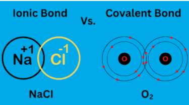

The video you shared titled "Introduction to Ionic Bonding and Covalent Bonding" provides an overview of these two types of chemical bonding. Here's a summary for you:

1. Ionic Bonding: This type of bonding occurs between atoms with a significant difference in electronegativity. One atom donates electrons to another, resulting in the formation of positively and negatively charged ions. These ions are held together by electrostatic forces, creating an ionic bond.

2. Covalent Bonding: In covalent bonding, atoms share electrons to achieve a more stable electron configuration. This type of bond is formed between atoms with similar electronegativity. Covalent bonds can be either polar or nonpolar, depending on the distribution of electrons between the atoms.

The video delves deeper into the concepts of ionic and covalent bonding, explaining their differences, properties, and examples. It provides a solid introduction to these fundamental concepts in chemistry. Enjoy expanding your knowledge of chemical bonding!

This is the link: [https://www.youtube.com/watch?v=S_k0kr2eZSQ](https://www.youtube.com/watch?v=S_k0kr2eZSQ)