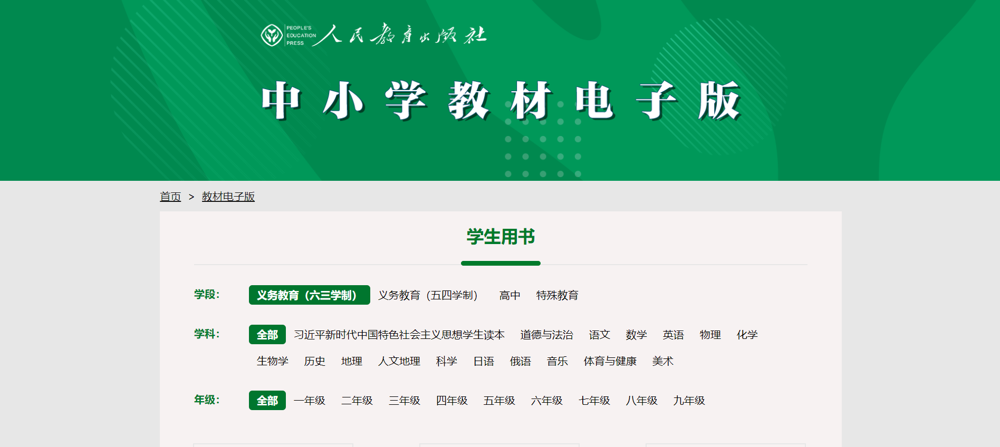

这是一个国家级的中小学各学科教材数字资源库。用户可以根据不同学科和年级进行查询,获得各学年各学科的标准教材电子版本,包括课本、习题册等教学资料。 
网站主要包含小学(一至六年级)和初中(一至三年级)各个学科的教材。常见学科包括语文、数学、英语、物理、化学等。每个学科下再细分不同年级,可以单独下载对应年级的教材PDF文件。 
从版本更新频率看,小学教材更新较为频繁,几乎每个学年都有新版本。而初中教材更新周期相对滞后一些。这可能与小学阶段知识掌握的重要性有关。 
总体来说,这个网站整合了当前中国基础教育各学科各年级的标准电子教材。它为教师和学生提供了一个免费、极具方便性的查询下载平台,有利于促进教学过程的数字化与智能化。用户可以根据个人需求选择下载其中的部分或全部教材资源。

这是链接：[https://jccs.mypep.com.cn/](https://jccs.mypep.com.cn/)