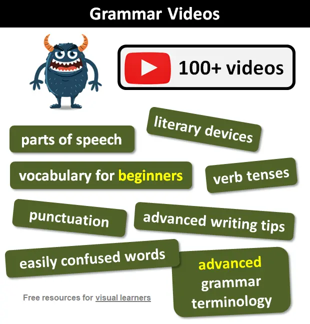

1. The website provides a huge number of freely accessible lessons, tests, games and exercises covering all aspects of English grammar from basic to advanced levels.

2. Resources are organized based on level (beginner, intermediate, advanced), grammar topics (parts of speech, punctuation, terminology etc.), and type (lessons, glossaries, lists). This makes content very easy to navigate.

3. Lessons are clear, concise yet comprehensive. They effectively explain grammar rules and include examples. Tests help reinforce learning with questions in different formats.

4. Games and interactive exercises make grammar learning enjoyable. Various customization options allow creating tests tailored for individual or classroom needs.

5. Both online and paper-based learning are well-supported through editable tests and study materials that can be printed/shared digitally.

6. Content is consistently updated based on user feedback to ensure accuracy and meet emerging needs. Extra resources like video lessons are also being added.

7. The website is extremely useful for students and teachers alike in improving English language proficiency, independently or in a classroom set-up.

In summary, the Free English Grammar Lessons and Tests website is a rich, one-stop grammar reference tool delivered through an organized, user-friendly interface - making complex concepts engaging and easy to comprehend for all levels of learners. 
link: [https://www.grammar-monster.com/](https://www.grammar-monster.com/) 
[go back](../english.html) 