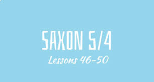

 
The Saxon Math 5/4 program is used as the core math curriculum for grades K-5 throughout Central Bucks School District. The Saxon Math 3rd Grade Student Edition, specifically written by Stephen Hake, is one of the key textbooks utilized in the 3rd grade math curriculum. 
Some key aspects of this textbook include:

1. It follows the incremental approach of the Saxon Math program, with new concepts introduced in small, manageable chunks and frequent review/practice of previously learned material. This is intended to minimize forgetting from one day to the next.

2. Lessons incorporate a variety of problem types, including one-step word problems, to build understanding and mastery of core 3rd grade math topics like multiplication, division, fractions, measurement and geometry.

3. The textbook provides examples worked out step-by-step along with independent practice problems for students. Answers and step-by-step explanations are included to allow for self-checking.

4. Cumulative assessments are included to test comprehension of material from the entire year. Scores are tracked to monitor individual progress.

5. Parent materials are provided to complement lessons and support learning at home through homework assignments and practice activities.

6. This is one of the primary self-guided study resources used by 3rd grade students in Central Bucks School District to develop proficiency with third grade math content and practice applying skills through varied problem-solving approaches, as outlined in the district curriculum. 
This is the link: [https://www.cbsd.org/cms/lib/PA01916442/Centricity/Domain/2472/Student%20Textbook%20-%205-4.pdf](https://www.cbsd.org/cms/lib/PA01916442/Centricity/Domain/2472/Student%20Textbook%20-%205-4.pdf) 
[go back](../math.html) 